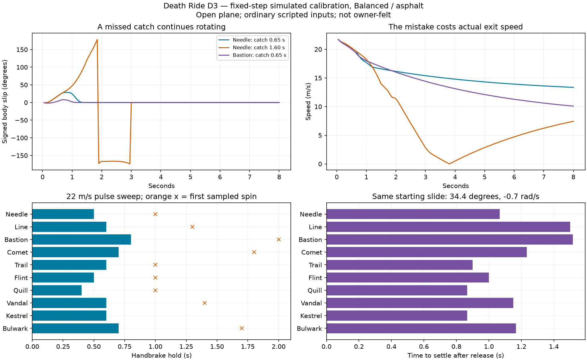

# D3 — Drift Lab calibration and owner checks (2026-10-01)

Design before running the broad calibration. D2 supplies the deterministic solver. This wave supplies reproducible headless experiments, interactive desktop tuning, explicit class-order witnesses and isolated Stick checks. All numerical results are simulated until stated otherwise; nothing is owner-felt.

The headless runner samples every class at low/medium/high entry speed. Experiments include steer step, sustained power, handbrake pulse/overhold, lift after power, brake in a corner, passive release, early/on-time/late countersteer, chicane, and an equal-angle coast/catch. A separate hold-duration sweep locates the first observed spin for each class. Recovery requires a sustained low-slip/low-yaw interval. CSV records requested and actual initial speed, maximum angle, retained speed, rotation time, spin onset, recovery time and exit speed, with time-series files for audit.

The equal-angle experiments isolate consequences after initiation: identical starting speed/slip/yaw, stock class geometry and mass. They complement the same-input experiments, where a heavy enters a smaller angle and therefore can appear to recover faster. Controlled spec perturbations additionally hold stats fixed while changing only mass, size or inertia.

Desktop libGDX gets a dedicated `--drift-lab` screen with keyboard driving, scripted replays, class/feel/surface selection, live global and per-class geometry sliders, telemetry/trace graphs and CSV export/import. Calibration values are session-local; exporting does not silently overwrite authored resource data. The existing remote/phone live feel switch stays available in the isolated Stick application.

The Stick build uses `dev.deathride.driftlab` and listener port 8766. Another run currently has two connected clients racing under `dev.deathride.tv`; do not foreground this app during that measurement. Installation and performance status will be recorded separately. Do not infer device performance from desktop/headless timing.


## Calibration method and actual changes

Ran the lab repeatedly, all ten classes at requested entries of 14/22/30 m/s, 12 exercises, eight simulated seconds each. Entries above a class cap are clamped and both speeds are recorded. A second sweep tests 0.1?3.0 s handbrake holds in 0.1 s increments: **360 scenarios + 900 hold probes per full candidate**. Inputs pass through the ordinary profile shaping and solver. No walls, combat or hidden pose corrections in these open-plane experiments. The separate wall test uses the actual `World.step` contact/damage path.

The sequence was not just a report of the first tuning:

1. **D2 baseline / `candidate-initial`:** long cars were being given larger wheel angles to cancel their wheelbase. Added a reference-wheelbase steering ratio, shared with the AI's demand estimate. This makes the long car's wide arc real. Reference wheelbase and speed offset moved into CSV.
2. **`candidate-wheelbase`:** geometry alone made Bastion's one-second pulse only 10.7 degrees, below useful initiation. Its release retained 74.4% speed. Reduced rear handbrake grip from .22 to .18, reduced handbrake longitudinal deceleration from 3 to 1.5 m/s?, and raised the physical-torque blend from .45 to .65. In `candidate-rear-release`, Bastion reached 20.1 degrees and retained 80.0%; Comet retained 88.8%. The lighter classes now needed a shorter pulse.
3. **`candidate-moderate` / `candidate-72`:** tested .60 vs .65 physical blend and .70 vs .72 wheelbase fractions for Needle/Quill. Kept .65 and .72. The longer light-car wheelbase gives a larger correction window while retaining easy over-rotation; there is still no class-specific spin flag threshold or force multiplier. A one-second Needle hold still spins. Its useful pulse is about half that duration.
4. **Grip audit:** the first axle model increased quarter-input steady yaw by 38?49% for several classes. A bicycle's neutral body-slip differs from W3's lateral damping; restoring raw body slip unintentionally amplified the grip servo. Added an analytical neutral rear-slip/reference-yaw compensation, fading away during handbrake/sliding and parking-speed recovery. The first candidate applied surface loss twice and broke ice recovery; removed that double application. The corrected model passes the existing ice/offtrack finish tests. No timeout or success threshold was relaxed.
5. **Tool round-trip:** a valid exported fade/spin pair can fail if loaded one row at a time against old defaults. CSV imports now validate the complete pair atomically, with a regression proving invalid imports leave the old tuning intact.

Archived candidate summaries, geometry and parameters are in `deathride/evidence/drift/d3/`. The final `calibrated` directory includes all 20 Hz traces compressed with gzip. Candidate folders are historical experiments from intermediate solver revisions, not all equivalent to applying their CSV to the final solver. The final runner records a compiled-solver fingerprint; current source plus final data reproduces the accepted run.

## Per-class results

All rows below use **Balanced, asphalt, 22 m/s**. ?Useful? is the first sampled hold that exits beyond 0.22 rad slip, stays below assist fade, avoids a spin and settles with the scripted catch. Catch time begins at release and includes 0.4 s settled below slip/yaw limits. Exit speed is sampled at four seconds, not at the instant of recovery. Spin holds are the **first observed in this finite input grid**, not a universal threshold. Kestrel's blank result means no spin in that grid; more aggressive steering/braking can still spin it. Different throttle, surface, upgrades, input timing and entry speed change these windows.

| Class | Useful HB hold (s) | Peak slip (deg) | Release speed (%) | Catch (s) | Exit at 4 s (m/s) | First spin hold (s) | Equal-angle catch (s) | Grip yaw delta (%) |
|---|---:|---:|---:|---:|---:|---:|---:|---:|
| Needle | 0.5 | 19.3 | 92.0 | 0.73 | 15.38 | 1.0 | 1.07 | +12.0 |
| Line | 0.6 | 14.3 | 89.2 | 0.70 | 13.62 | 1.3 | 1.50 | +7.7 |
| Bastion | 0.8 | 13.3 | 84.7 | 0.68 | 12.78 | 2.0 | 1.52 | -11.3 |
| Comet | 0.7 | 15.6 | 92.3 | 0.67 | 15.73 | 1.8 | 1.23 | -21.0 |
| Trail | 0.6 | 21.1 | 84.4 | 0.75 | 13.79 | 1.0 | 0.90 | +19.3 |
| Flint | 0.5 | 15.6 | 93.4 | 0.67 | 16.73 | 1.0 | 1.00 | +15.9 |
| Quill | 0.4 | 13.6 | 94.0 | 0.58 | 17.43 | 1.0 | 0.87 | +9.2 |
| Vandal | 0.6 | 14.4 | 89.6 | 0.68 | 14.76 | 1.4 | 1.15 | -1.1 |
| Kestrel | 0.6 | 14.2 | 91.2 | 0.58 | 17.23 | not observed | 0.87 | -25.0 |
| Bulwark | 0.7 | 16.0 | 93.5 | 0.72 | 16.90 | 1.7 | 1.17 | -13.7 |

The ?equal-angle catch? starts every class at 0.60 rad body slip and -0.70 rad/s yaw, without throttle. Bastion takes 1.52 s versus Needle's 1.07 s, and has over twice Needle's absolute momentum after one second. In the one-second entry test, Bastion needs 0.57 s to turn 0.35 rad, Needle 0.37 s. Comet takes 0.50 s. These witnesses separate initiation from consequences: a heavy that enters only a small angle can recover sooner than a light that entered a much larger angle. Mass alone does not change acceleration when force is exactly proportional to normal load; the authored tyre load sensitivity, geometry and inertia provide the declared differences.

Needle's early 0.65 s catch stays recoverable; the late 1.60 s catch crosses the real spin range, continues rotating and loses most of its exit speed. Sustained power, lift and brake do not all give the same outcome: axle normal-load movement and the shared force budget matter. Peak slip at very low speed is deliberately reported as zero below the regularization speed, so a zero in the plotted tail is not proof of heading realignment.



## Declared grip/profile changes

No row of `feel.csv` changed. All five profiles still shape steering, throttle and recovery, and retain their original W1/no-roster acceptance tests. The table's grip delta compares D3 to the retained W3 solver at **18 m/s pinned speed, steering .25, throttle .30, last second of a three-second run**. It is a controlled yaw-response probe, not a lap-time or human feel measurement. `grip-profile-comparison.csv` contains all ten classes and all five profiles.

The final Balanced yaw changes range from -25.0% (Kestrel) to +19.3% (Trail). Long wheelbases turn wider; the short classes generally turn faster. On Line the change is +7.7%. These are deliberate, visible roster changes that need owner judgement. Do not treat unchanged profile data as a guarantee of identical grip feel. Shared traction under throttle/brake, rear-load movement and slower heavy turn-in also alter driving. AI remains a grip driver using ordinary inputs and the same capacities; no drift boost or scoring/economy change was added.

## Reproduce and tune

From `deathride` in PowerShell:

```powershell
.\gradlew.bat :core:driftLab '-PdriftOutput=build/reports/drift-lab-calibrated'
python tools/drift-report.py core/build/reports/drift-lab-calibrated --output evidence/drift/d3
.\gradlew.bat :desktop:run '--args=--drift-lab'
```

Run `:core:test --tests dev.deathride.core.DriftLabTest` first if class-witness/profile-comparison CSVs are absent. The plotting helper needs Python matplotlib; it produces standalone PNG/SVG plus a Markdown table. Headless runner options are `driftOverrides` (key/value CSV), `driftGeometryOverrides` (class CSV), `driftClass` (one ID), `driftTraces=false`. Paths resolve under `core`, so an export can be replayed with `'-PdriftOverrides=../build/drift-calibration/last/drift.csv'` and the corresponding geometry option.

Desktop: **W / A D / S / Shift** drive, steer, brake and handbrake. **C** cycles classes, **F** feel profiles, **V** surfaces, **X** exercises, **F1** manual/replay, **R** resets the entry, **P** pauses. The entry-speed slider applies on reset. Global sliders change the next tick; **G** switches to the selected class's geometry sliders; wheel scrolls. **E** exports global and all class data to `build/drift-calibration/last`, **L** imports it, **T** restores source defaults. Files do not overwrite authored tuning automatically. Open-plane manual practice has no walls; follow with the normal race on actual tracks.

The automated desktop audit drives the actual slider input handler, verifies curve and inertia changes, exports/imports, switches profile and runs a replay. `--drift-lab --drift-lab-check --duration=5` emits a JSON result and screenshot under `build/drift-calibration`. Audit values deliberately exaggerate sliders to test wiring; **they are not the accepted tuning**. Press T before judging an imported audit export.

## Device and final gate

**Final gate passed:** `:core:test :link:test :app:assembleDebug`, 103 core + 3 link tests, no failures/errors/skips, 5m12s. The desktop slider/CSV/profile/replay audit and 360-scenario/900-probe report also passed. Defaults in this branch are `appId=dev.deathride.driftlab`, label `Death Ride Drift Lab`, port **8766**. The namespace remains `dev.deathride.tv`; launch component is `dev.deathride.driftlab/dev.deathride.tv.MainActivity`. Integration may explicitly override the three Gradle properties when merging. The normal desktop game also defaults to 8766 and accepts `--port=`; the dedicated calibration screen has no LAN server.

### Actual Stick result (AFTKM, Android 11)

Scanned all 254 addresses in `10.0.0.0/24` for ADB 5555 and found `10.0.0.139`. Waited while the concurrent run used the TV/art-lab apps; installed after it returned to Home with zero connected clients. Static APK inspection verified the isolated ID/label, three native ABIs and Leanback entry. The `dev.deathride.tv` version and installation timestamps are identical before/after this session. The lab was returned to Home and force-stopped after measurement; its installed APK remains available.

`tools/drift-probe.mjs` drove all ten stock classes in five two-player Foundry sessions using **ordinary 30 Hz LAN input messages**, four normal AIs and all shipped effects. All five live feel profiles switched successfully; driving comparisons then used Balanced. The run lasted 160.2 wall seconds including selection/countdowns, targeting 30 seconds per pair. Quill/Vandal ended at 19.35 race seconds with both players wrecked. This is an effects/input/performance check, not a completed-lap skill or combat-fairness result. No cars were made invulnerable or kept artificially alive.

The renderer counted **374 drift smoke emissions and 760 drift skid emissions**. Both human slots reported real drift quality and spins; 4,769 inputs per slot were accepted, zero rejected. The full raw windows preserve all phases. Below are the worst **complete-race rolling ten-second** p95 and maxima, including the final shorter Quill/Vandal session. Overlapping rolling populations are not summed as unique frame counts.

| Classes | Frame p95 / max (ms) | Step p95 / max (ms) | Drift smoke / skids |
|---|---:|---:|---:|
| Needle / Line | 20.86 / 29.26 | 2.48 / 7.28 | 54 / 111 |
| Bastion / Comet | 20.42 / 27.42 | 2.29 / 5.26 | 98 / 205 |
| Trail / Flint | 20.50 / 28.33 | 2.41 / 5.40 | 82 / 173 |
| Quill / Vandal | 20.80 / 25.56 | 2.39 / 4.67 | 61 / 117 |
| Kestrel / Bulwark | 20.37 / 26.48 | 2.34 / 4.99 | 79 / 154 |

**Strict frame budget is not passed:** worst race-window frame p95 **20.86 ms** exceeds 16.7 ms; worst active maximum **29.26 ms** is below 33 ms. Worst step p95 **2.48 ms**, maximum **7.28 ms**. The worst frame p95 is below W1's observed 21.53 ms, but these are different loads and this is not a controlled proof of improvement. Whole-process histogram p50/p95 is **16.7/20.1 ms**, exact maximum **243.37 ms**, n=14,703; startup/transitions are not silently excluded from that lifetime result. Elapsed-time-clamp counter rose from 180 to 340 ms across the measured sequence, including menu/round changes. Final active window had zero clamp increments.

LAN acknowledgement RTT p95 was 64.22/64.56 ms, maximum 103.14/103.11 ms. RTT is not input-to-photon latency. The sender PC was also running the final test suite. After the timing run, `dumpsys meminfo --local` measured 114,581 KiB PSS and thermal HAL reported CPU 58.38 C / GPU 41.59 C, status 0. A single post-run sample establishes neither thermal stability nor leak freedom. The screenshot is the later results screen, not a frozen proof of an active slide; actual effects are established by the emission counters and per-window telemetry.

Evidence: `deathride/evidence/drift/d3/stick-probe.json.gz`, `stick-probe-summary.json`, `device-isolation.json`, package records, memory/thermal snapshots and screenshot. Desktop also passed the five-pair ordinary-input probe, 2,774 accepted inputs per slot, zero rejected, with 273 smoke / 587 skid emissions; its timing is not substituted for the Stick result. Summarize a new run with `python tools/drift-probe-report.py PATH.json`. Install tool dependencies with `npm ci` under `tools`; the probe command is `node drift-probe.mjs http://HOST:8766 PIN OUTPUT.json 30`. It refuses other ports and occupied connected seats. Restart only the isolated lab process before a fresh pairing run, since disconnected seats remain reserved.

## What remains hard to calibrate

Numerical recovery and zero-allocation guarantees do not certify satisfaction. Human catch timing, the useful angle range on a phone, short/light sensitivity on gravel/ice, heavy slides in traffic, higher upgrade tiers, haptic strength and perceived snap-back need play. The owner has not felt this tuning. There is no drift boost to conceal a poor exit and no camera roll experiment in this wave. Physics remains an arcade blend with an approximate contact solver, not a full four-wheel tyre/suspension simulation. The ten-class exercises in `deathride/OWNER-CHECKS.md` supply specific good/bad vocabulary for the next owner session.
